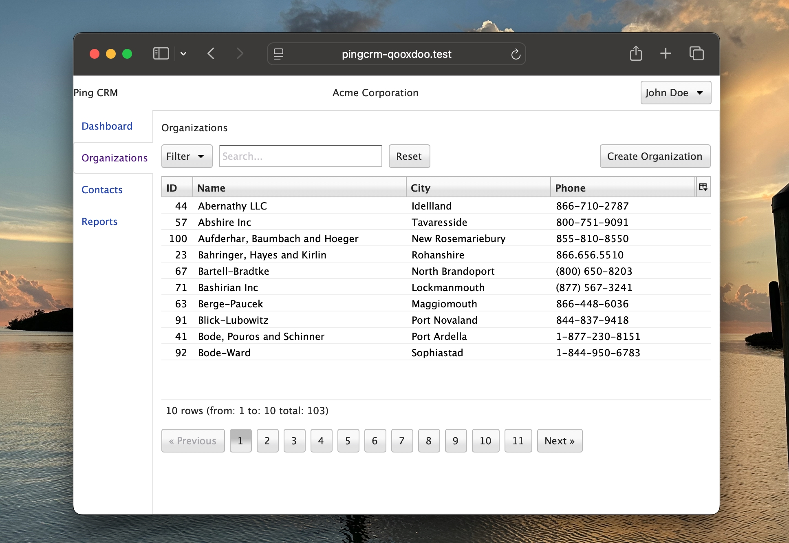

# qxapp

qxapp is a [Qooxdoo](https://qooxdoo.org/) front-end, demo application that illustrates how Qooxdoo and [Inertia.js](https://inertiajs.com/) work together.

The back-end application is [Ping CRM](https://github.com/inertiajs/pingcrm).



## Installation

To get it working on a local instance:

1. Setup Ping CRM
2. Add a new folder named qxapp to the resources folder
3. Add this application to the new qxapp folder
4. Locally install the qooxdoo framework
5. Update the app.blade.php blade file (located in resources/views folder) to point to the compiled qxapp applicaition (see example below)

```html
{{-- Qooxdoo --}}
<script type="text/javascript" src="/compiled/source/qxapp/index.js"></script>
@inertiaHead

</head>
<body>
    @inertia
</body>
</html>
```

6. Compile the qxapp application

```sh
npx qx compile --watch
```

7. Update the compiled commonjs-browserify.js to properly reference inertiajs axios object

* Open the file located in the public/compiled/source/qxapp folder.
* Search the commonjs-browserify.js file for "require("axios")" (there should only be one).
* Add ".default" to the end for it to be "require("axios").default". Below is an illustration:

**Important Note:** You will have to repeat step 7 after every run of ```npx qx clean```.

```js
// before
var he = Y(require("axios"), 1);

// after
var he = Y(require("axios").default, 1);
```
